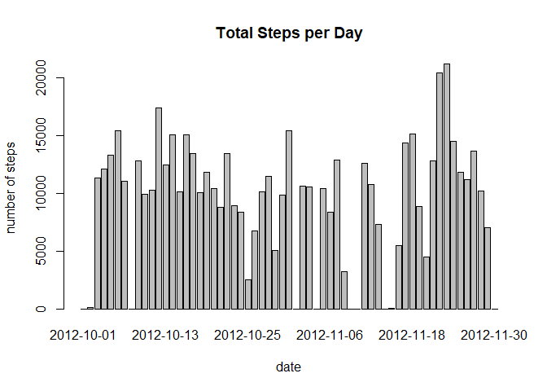
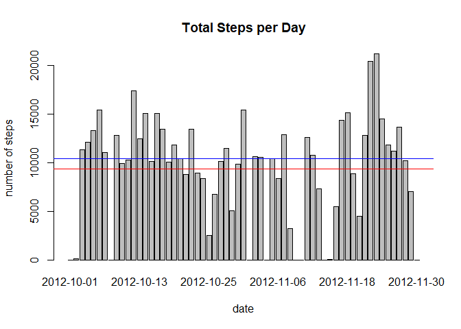
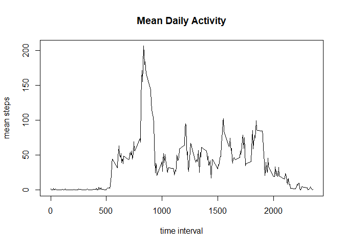
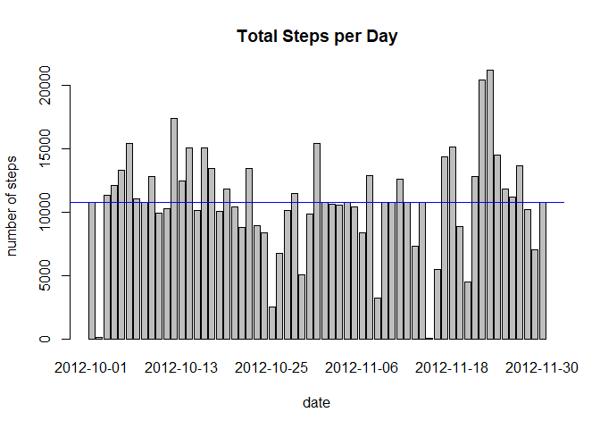
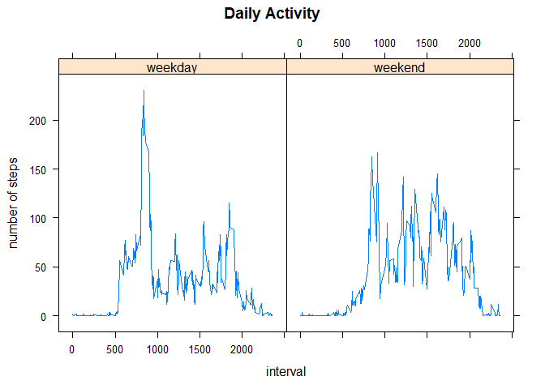

## Loading and preprocessing the data

First, we will download the data directly from R and since it's a zip file, we will also directly unzip it. The file is a .csv file, so we can easily load it into R using the `read.csv()` function.

```r
# Download the data file
dataurl <- "https://d396qusza40orc.cloudfront.net/repdata%2Fdata%2Factivity.zip"
download.file(dataurl, destfile = "data.zip")
unzip("data.zip")

# Read data into R
data <- read.csv("activity.csv")
data$date <- as.Date(data$date)

str(data)
```

```
## 'data.frame':	17568 obs. of  3 variables:
##  $ steps   : int  NA NA NA NA NA NA NA NA NA NA ...
##  $ date    : Date, format: "2012-10-01" "2012-10-01" ...
##  $ interval: int  0 5 10 15 20 25 30 35 40 45 ...
```

```r
head(data)
```

```
##   steps       date interval
## 1    NA 2012-10-01        0
## 2    NA 2012-10-01        5
## 3    NA 2012-10-01       10
## 4    NA 2012-10-01       15
## 5    NA 2012-10-01       20
## 6    NA 2012-10-01       25
```
Taking a look into the datatable, we see that there are three variables (`steps`, `date` and `interval`) with 17568 observations.


## What is mean total number of steps taken per day?
To calculate the mean total number of steps taken per day, I summed the steps for each day using the `aggregate` function. I ignored `NA` values, assuming them the value 0. 


```r
# Compute step sums for each day
day_step_sum <- aggregate(data$steps, by = list(date = data$date), FUN = sum, na.rm = TRUE)

head(day_step_sum)
```

```
##         date     x
## 1 2012-10-01     0
## 2 2012-10-02   126
## 3 2012-10-03 11352
## 4 2012-10-04 12116
## 5 2012-10-05 13294
## 6 2012-10-06 15420
```

```r
barplot(day_step_sum$x ~ day_step_sum$date,
        xlab = "date", ylab = "number of steps",
        main = "Total Steps per Day")
```

<!-- -->

To get the mean total number of steps, I simply use the `mean` or `median` function:


```r
day_step_mean <- mean(day_step_sum$x)
day_step_median <- median(day_step_sum$x)

day_step_mean
```

```
## [1] 9354.23
```

```r
day_step_median
```

```
## [1] 10395
```

We can also plot this directly into our histogram:


```r
barplot(day_step_sum$x ~ day_step_sum$date,
        xlab = "date", ylab = "number of steps", main = "Total Steps per Day") +
abline(h = day_step_mean, col = "red", ) +
abline(h = day_step_median, col = "blue")
```

<!-- -->

```
## numeric(0)
```

## What is the average daily activity pattern?

For the next assignment, we need to average daily steps within the same interval. That means, I rerun the `aggregate` function, but this time over the `interval` variable.


```r
interval_step_mean <- aggregate(data$steps, by = list(interval = data$interval), FUN = mean, na.rm = TRUE)

interval_step_mean[which.max(interval_step_mean$x), ]
```

```
##     interval        x
## 104      835 206.1698
```

The 835s interval has the highest mean step with about 206 steps per 5 minutes.
Now we can draw the lineplot:

```r
plot(x = interval_step_mean$interval, y = interval_step_mean$x, type = "l",
     ylab = "mean steps", xlab = "time interval",
     main = "Mean Daily Activity")
```

<!-- -->

## Imputing missing values

To count the number of `NA` values in the dataset, I used the `is.na` function which returns `TRUE` for these values.


```r
sum(is.na(data))
```

```
## [1] 2304
```
Next, I will replace the NA values. I use the strategy to use the mean interval steps which we computed before. I first determine the position of NA values, then I make a copy of the dataset and assign the mean steps of the corresponding interval. Afterwards, I recompute the mean and median of the daily total steps and make a new barplot.

```r
# Get the position of each NA value in the dataframe
na.index <- which(is.na(data$steps))
# Get the interval of each NA value
na.interval <- data$interval[na.index]

# Make a copy of the data dataframe
data.narm <- data

# Assign the step values of the respective interval to the NA values
data.narm$steps[na.index] <- interval_step_mean$x[match(na.interval, interval_step_mean$interval)]

# New total calculation
day_step_sum_new <- aggregate(data.narm$steps, by = list(date = data.narm$date), FUN = sum)

mean(day_step_sum_new$x)
```

```
## [1] 10766.19
```

```r
median(day_step_sum_new$x)
```

```
## [1] 10766.19
```

```r
barplot(day_step_sum_new$x ~ day_step_sum_new$date,
        xlab = "date", ylab = "number of steps",
        main = "Total Steps per Day") +
        abline(h = mean(day_step_sum_new$x), col = "red") +
        abline(h = median(day_step_sum_new$x), col = "blue")
```

<!-- -->

```
## numeric(0)
```

## Are there differences in activity patterns between weekdays and weekends?

I used the `ifelse` function to assign whether a day is a weekend or a weekday. Then I computed the mean values for interval and weekday grouping. Lastly, I plotted the panel figure using the `lattice` package.

```r
# Assign Weekday
data.narm$weekday <- ifelse(weekdays(data.narm$date) %in% c("Saturday", "Sunday"), "weekend", "weekday")

wkd_interval_mean <- aggregate(data.narm$steps, 
                               by = list(wkd = data.narm$weekday, 
                                         interval = data.narm$interval), 
                               FUN = mean)

library("lattice")
```

```
## Warning: package 'lattice' was built under R version 4.0.3
```

```r
xyplot(x ~ interval | wkd, data = wkd_interval_mean, type = "l",
        xlab = "interval", ylab = "number of steps",
        main = "Daily Activity")
```

<!-- -->

As you can see in the figure, there's a difference between weekdays and weekends.
